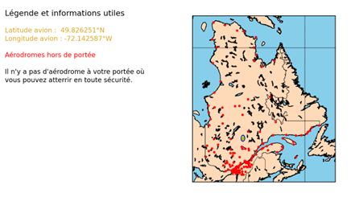

# Projet spécial
## Développement d'un outil d'aide à la prise de décision pour un pilote d'avion en détresse
***
## Table des matières
1. [Informations générales](#informations-générales)
2. [Installation et exécution de l'application](#installation-et-exécution-de-l'application)
3. [Détails des paramètres d'entrée et des résultats fournis](#détails-des-paramètres-d'entrée-et-des-résultats-fournis)
4. [Structure du programme](#structure-du-programme)
5. [Description des étapes du programme](#description-des-étapes-du-programme)
6. [Test](#test)
7. [Références](#références)
***
### Informations générales
***
L’objectif de ce projet est de fournir un programme permettant à un pilote d’avion 
survolant le Québec de déterminer les aéroports québécois sur lesquels il pourrait atterrir en cas 
d’urgence en fonction de sa position au moment de l’alerte.
Pour cela, différents types de paramètres sont pris en compte : 
- Les paramètres de l’avion.
- Les paramètres des aéroports québécois.
- Certains paramètres météorologiques.

Vous retrouverez, dans ce fichier, une description des fonctionnalités que présente l'application, des données prises en compte, de la structure du programme ainsi que la méthode de détermination des résultats.
***
### Installation et exécution de l'application
***
Dans ce dépôt, vous pouvez retrouver différents fichiers qui seront indispensables au bon fonctionnement de l'application :

* Un fichier README.md, décrivant le projet et la méthode d'utilisation (que vous êtes en train de lire actuellement). 
* Un dossier SolutionAtterrissage contenant tous les modules nécessaires pour l'utilisation de l'application
* Un fichier main.py faisant appel aux modules contenus dans le dossier SolutionAtterrissage permettant d'exécuter l'application
* Un fichier requirements.txt répertoriant toutes les librairies utilisées par l'application
* Un fichier LICENSE.md décrivant les conditions de la license 'MIT License' choisie

Le projet a été réalisé et testé avec la version 3.9 de Python. Pour utiliser l'application, il vous faudra suivre les étapes suivantes. 
* Dans un premier temps créez un environnement virtuel avec Python 3.9 ou une version ultérieure.
* Une fois l'environnement virtuel créé, exécutez la commande `pip install -r requirements.txt` dans le terminal afin d'installer les librairies utilisées par le programme.
* Exécutez ensuite la commande `python main.py` dans le terminal pour lancer l'application.

***
### Détails des paramètres d'entrée et des résultats fournis
***
Cette application utilise différents types de données. Il s'agit de bases de données ainsi que des paramètres utilisateurs intrinsèques à l'avion et à la situation. Pour faciliter l'utilisation, les paramètres utilisateurs seront à entrer par l'utilisateur dans un fichier YAML, dont l'utilisation est intuitive. 

Ces paramètres sont les suivants : 
- La position GPS et l'altitude de l'avion
- Le cap suivi
- La vitesse
- La vitesse de l'avion en vol plané
- Le type d'avarie (moteur utilisable ou non)
- La quantité de carburant restante
- La distance de roulage minimum à l'atterrissage
- La finesse de l'avion

Les bases de données sont les suivantes : 
- Un fichier contenant de nombreuses informations météorologiques en un point précis du globe généré par le site Windy.com. Celle-ci permet d'obtenir le vent et la température en différents points pour le calcul du rayon d'action
- Un fichier contenant de nombreuses informations sur tous les aérodromes du Québec obtenue sur le site donneesquebec.ca

En retour, l'application fournit une carte annotée ainsi que des indications nécessaires pour le pilote. Sur cette carte du Québec, tous les aéroports seront localisés et un code couleur lui indique lesquels sont atteignables et lesquels possèdent une piste d'atterrissage assez longue pour atterrir en toute sécurité. Deux zones sont également délimitées par des ovoïdes vert et bleu, représentant respectivement le rayon d'action en prenant en compte l'action du vent et le rayon d'action sans prendre en compte le vent. 

Les indications qui s'affichent sur la gauche de la carte légendent la carte et indique les coordonnées GPS de l'aéroport optimal et le nouveau cap à prendre pour le rejoindre. L'application indique également la distance ajoutée par la prise en compte du virage afin que le pilote puisse se rendre compte de l'impact de la manoeuvre sur la distance à parcourir. 

***
### Structure du programme
***
Le programme est décomposé en un module global et de plusieurs sous-modules. 

Le module global : "SolutionAtterrissage" comporte l'ensemble des sous-modules et son fichier __init__ permettant d'importer chaque sous-modules

Les sous-modules : 
- aerodrome : il regroupe les fichiers .py des classes Aerodrome et Piste mais aussi les fonctions associées à ses classes ou les fonctions effectuant des operations utilisant ces classes.
  
- affichage : ce module rassemble les fonctions permettant de realiser l'ensemble de l'affichage de la solution. Notamment les fonctions d'affichage de la carte du Quebec avec basemap mais aussi les fonctions de caculs permettant d'ajouter des éléments d'affichage.
  
-  atmosphere : ce module contient la classe Air qui est utile dans le module avion. Il contient aussi les fonctions permettant de recuperer les données du vent et de température et d'y faire les calculs associés.

-  avion : le module avion contient les fichiers pythons permettant de créer l'objet Avion à l'aide d'une classe et servant à définir un avion à partir de certaines données récupérées du fichier yaml. Il contient aussi une classe Performance qui permet de regrouper les informations de performance de l'avion. Cette classe Performance possède l'ensemble des méthodes de cacul des distances franchissables théoriques et impactées par le vent ainsi que la méthode pour calculer la consommation de carburant.

-  donnees : ce module rassemble les fichiers de données qui sont utiles au fonctionnement de notre programme. C'est-à-dire, le fichier csv de la base de donnée des aérodromes et des pistes, le fichier de données de l'avion au format yaml. Dans ce module est présent le fichier de la classe LecteurYAML qui permet de créer un lecteur pouvant lire n'importe quel fichier .yaml.

En dehors du module global se situent le fichier main.py qui permet de réaliser toute la procédure de calcul et d'affichage de la solution.
L'ensemble des fichiers permettant l'installation du modules sont aussi présent à ce niveau :
- LICENSE.md
- setup.cfg
- setup.py
- requirements.txt

Enfin, ce fichier README.md qui décrit l'ensemble du projet.

***
### Description des étapes du programme
***

Cette partie décrit les étapes dans l'ordre d'exécution que réalise le programme pour obtenir les résultats attendus. 

* Prise en compte des paramètres utilisateurs : l'utilisateur remplit le fichier YAML avec les données intrinsèques à l'avion et les paramètres au moment de l'avarie
* Récupération de la température aux coordonnées et à l'altitude de l'avion : cette température est nécessaire car elle a une influence sur la consommation de carburant de l'avion
* Calcul du rayon d'action théorique : un premier rayon d'action sans prise en compte du vent est calculé. Celui-ci dépend avant tout du type d'avarie : l'avion peut-il utiliser ses moteurs ou non ? La vitesse de l'avion, la quantité de carburant restante, l'altitude et la consommation sont également des paramètres pris en compte pour ce calcul.
* Discrétisation du cercle atteignable et détermination des coordonnées des points de ce cercle : ce cercle a son centre à la position de l'avion et a pour rayon le rayon d'action calculé.  
* Discrétisation des segments avion-point_du_cercle et détermination des coordonnées de tous ces points
* Récupération des "vecteurs vent" en chaque point du cercle mais également aux points de dicrétisation des segments avion-point_du_cercle déterminés à l'étape précédente
* Calcul des "vecteurs vent" moyens sur chaque segments avion-point_du_cercle
* Correction du range théorique précédemment calculé en prenant en compte le vent : nous ne considérons plus que la vitesse au sol est égale à  la vitesse vraie de l'avion (c'est-à-dire sa vitesse sol à laquelle ajoute la vitesse de déplacement de la masse d'air dans laquelle il évolue). La vitesse vraie est donc déterminée et un nouveau rayon d'action est calculé pour chaque direction.
* Détermination des aéroports atteignables : ce sont ceux inclus dans le nouveau rayon d'action de l'avion
* Tri des aéroports atteignables : parmi tous les aéroports atteignables, seuls ceux possédant une piste de longueur suffisante sont conservés
* Calcul du nouveau cap à emprunter et de la distance supplémentaire qui sera engendrée par un éventuel virage : ces informations seront utiles pour le pilote et seront affichées à côté de la carte
* Affichage de la carte avec sa légende et des informations utiles pour le pilote

***
## Test
***
Pour tester ce programme et vérifier son efficacité nous avons effectué une série de test.
Tout d’abord, vérifier que les vents ont le bon effet sur le nouveau rayon d’action de l’avion.

Nous pouvons voir que le vent se dirige peu vers l’est, donc selon les x, et beaucoup vers le nord, donc selon les y :

Résultat qui correspond bien à l’affichage (cercle vert déplacé vers le haut et un peu vers la droite par rapport au cercle bleu) :

Par ailleurs, si l’avion ne peut pas se rendre à un aéroport (si par exemple l’avion n’a plus de moteurs opérationnels), l’affichage se modifie et la situation devient critique :

Il est par ailleurs possible de modifier la position de l’avion, qui va modifier le vent autour de celui-ci, modifier l’aéroport le plus proche et ainsi modifier le nouveau cap à prendre :

***
## Références
***
Les lien pour accéder aux bases de données utilisées dans le code sont répertoriés ci-dessous : 
* Aéroport - Piste - Aéroport - Piste - Données Québec. 
https://www.donneesquebec.ca/recherche/dataset/aeroportpiste/resource/b66e3e23-10af-457d-b95e-b5011126fba
* Windy.com. Wind map & weather forecast.
https://www.windy.com
